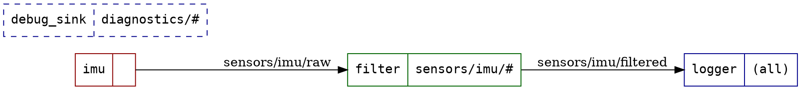

# NEW_FEATURES.md — MADS v2.4/v2.5 feature roadmap (P1–P6)

Six features proposed to make MADS more approachable and more competitive against
other IoT/robotics pub-sub frameworks (ROS 2, MQTT-based stacks), based on a review
of the current `v2` branch. P2, P3 and P5 were designed in depth in a prior planning
session (including a resolved architecture decision on P5's config-parser ownership);
P1, P4 and P6 are designed here at the same level of detail so all six are equally
ready to implement.

Each feature ships on its own branch, named `feat/P<n>`, implemented sequentially
within its dependency chain and committed as `paolo.bosetti@unitn.it`.

## Dependency graph

```
v2 ──┬── feat/P2 (MQTT-style topic matching) ──┬── feat/P1 (mads echo / mads top)
     │                                          ├── feat/P3 (bag record & replay)
     │                                          └── feat/P6 (MQTT bridge)
     │
     └── feat/P5 (mads up) ─────────────────────── feat/P4 (mads doctor)
```

`feat/P2` and `feat/P5` are independent and branch directly from `v2`. Everything
else forks from the tip of the feature it depends on and is implemented after that
parent is done, so its own branch starts from working code rather than a moving target.

## Summary table

| # | Feature | Depends on | Branch base | Tier | Target |
|---|---------|-----------|-------------|------|--------|
| P1 | `mads echo` / `mads top` | P2 | `feat/P2` | IMPROVEMENT | v2.4.x |
| P2 | MQTT-style topic wildcards | — | `v2` | IMPROVEMENT | v2.4.x |
| P3 | `mads-record` / `mads-play` (bag) | P2 | `feat/P2` | IMPROVEMENT | v2.4.x |
| P4 | `mads doctor` | P5 | `feat/P5` | IMPROVEMENT | v2.4.x |
| P5 | `mads up` (headless `director.toml`) | — | `v2` | IMPROVEMENT | v2.4.x |
| P6 | MQTT bridge agent | P2 | `feat/P2` | IMPROVEMENT | v2.4.x |

**Tier rationale, applied uniformly:** none of the six changes an existing public
API signature, the wire protocol, or `LIB_VERSION_CHECK` (a minor bump is reserved
for hard compat breaks, per `RUNTIME.md`/`MINOR_UPDATE.md`). Every feature is either
a brand-new auto-discovered `mads-*` executable (no dispatcher/CMake changes needed,
per the existing `mads.cpp` `exec_dir` auto-discovery and `src/main/*.cpp` auto-glob)
or an additive method/opt-in behaviour on an existing class. New third-party
dependencies (`reproc` for P5, an MQTT client for P6) are `FetchContent`-vendored and
CMake-optional, mirroring how `MADS_ENABLE_MONGOCXX` already keeps the Mongo driver
out of the default build. That makes all six safe to land in `v2.4.x` rather than
forcing them to wait for `v2.5.0`. If implementation surfaces a reason to break
compatibility (e.g. a P2 corner case that can't stay wire-compatible), flag it and
revisit that feature's tier before merging — don't silently ship a break under an
IMPROVEMENT label.

---

## P2 — MQTT-style topic wildcard matching

**Depends on:** none · **Branch:** `feat/P2` from `v2`

### Motivation

MADS topics are already hierarchical (`sensors/acc/x`), and subscriptions already
exploit ZeroMQ's raw byte-prefix `SUB` matching. A `glob`-style wildcard (`sensors*`)
is the wrong model here — `*` would need to cross `/` boundaries inconsistently.
Mirroring **MQTT's wildcard grammar** (`+` = exactly one level, `#` = this level and
everything below, only legal as the final token) fits the existing topic convention
and is instantly familiar to anyone coming from an MQTT-based stack — which is most
of the target audience for P6 as well.

### Design — non-disruptive by construction

ZeroMQ's `SUB` socket only understands literal byte-prefix matching; it has no idea
what a wildcard is. So:

- A `sub_topic` entry with **no** `+`/`#` subscribes exactly as today — identical
  `zmqpp::socket::subscribe()` call, identical wire `SUBSCRIBE` frame, zero behaviour
  change for every existing deployment.
- A `sub_topic` entry **containing** `+`/`#` is handled in two stages: (1) compute the
  longest literal prefix before the first wildcard token and issue *that* as the raw
  ZMQ subscribe (broader than needed, e.g. `sensors/#` → subscribe `sensors/`); (2)
  apply an in-process MQTT-pattern match against each arriving message's real topic
  before it reaches `receive()`/callbacks, silently dropping non-matches. The extra
  fan-in is bounded by whatever the broker already fans out under that prefix.

### Files

- `src/topic_match.hpp` (+ `.cpp` if the implementation grows past header-only) —
  `bool Mads::topic_match(std::string_view pattern, std::string_view topic)`, pure,
  no dependencies on `Agent`/ZMQ. Also exposes `literal_prefix(pattern)` for the
  subscribe-side use.
- `src/agent.cpp` — the subscribe loop (`_subscriber.subscribe(t)`, currently
  `agent.cpp:1197`) switches to `literal_prefix(t)`; the receive path gains a filter
  step using `topic_match` when `_sub_topic` contains any wildcard entries. Skip the
  filter entirely (today's exact behaviour) when it doesn't, to keep the hot path free
  of overhead for the common case.
- No change to `set_sub_topic()`/`sub_topic()` signatures — still `vector<string>`.

### Tests

- `tests/test_topic_match.cpp` — pure, table-driven: `+` matches exactly one level,
  `#` matches zero-or-more trailing levels *and* the parent itself (MQTT semantics),
  `#` only legal as the last token (reject `sensors/#/x`), literal segments matched
  exactly, prefix computation for a battery of patterns.
- Extend `tests/test_agent_pubsub.cpp` with a wildcard subscription case over loopback
  to prove the two-stage filtering actually suppresses non-matching messages end to end.

### Docs

- `CONTEXT.md`'s "Settings model" section gains a paragraph on the wildcard grammar.
- `CHANGES.md` under v2.4.0 New features.

---

## P3 — `mads-record` / `mads-play`: bag record & replay

**Depends on:** P2 (`--topics` filter uses MQTT-style matching) · **Branch:** `feat/P3` from `feat/P2`

### Format decision

A **bespoke binary bag format**, not MCAP, as the primary format:

- MADS wire messages are already multi-part ZMQ frames (topic + one or more JSON/blob
  parts); a small custom format stores that shape byte-identical with no impedance
  mismatch and no new mandatory dependency.
- MCAP is built for the ROS 2/Foxglove ecosystem MADS isn't part of; pulling it in as
  a hard dependency buys little for the cost. It's kept as an **optional export**
  target instead (`mads bag export --format mcap`, behind a CMake option), so
  interop with Foxglove etc. is available without being forced on everyone.

### File layout

- Header: magic bytes + `format_ver` (u32). A bad magic or a `format_ver` newer than
  the reader supports is a clean, reported error — never UB.
- Records: `timestamp` (int64 ns) + length-prefixed `topic` + N length-prefixed parts
  (so multi-part frames and blobs round-trip byte-identical). Optional per-record
  CRC32, enabled by default.
- Trailing **index + footer**: record offsets and first/last timestamp, for O(1)
  `mads bag info` and fast seeking. If the footer is missing (process killed
  mid-capture), the reader falls back to a **linear scan** that recovers the complete
  valid prefix and reports `truncated()` rather than failing.

### New `Agent` methods (additive)

`receive_raw_message()` / `publish_raw_message()` — expose the raw multi-part frame
(topic + parts) without JSON (de)serialization, so the recorder/player never round-trip
through `nlohmann::json` and blobs survive untouched. Pure additions, ~10 lines, no
change to any existing method.

### Executables

- `mads-record` (`mads record`) — subscribes per `sub_topic` (MQTT filters via P2)
  and writes a bag file.
- `mads-play` (`mads play`) — reads a bag and republishes. `--restamp` rewrites
  `timestamp` while leaving the rest byte-identical; `--topics 'sensors/#'` replays
  only the matching subset (P2); `--rate` paces replay relative to recorded gaps.
- `mads bag info` / `mads bag export --format jsonl` (and later `--format mcap`).

### Tests

- `tests/test_bag.cpp` — pure `BagWriter`/`BagReader`, no sockets: round-trip N
  records incl. a ~1 MB blob part, byte-identical parts/ordering; truncated-tail
  recovery; missing-footer linear-scan fallback matches the indexed path; index
  counts/first/last vs. linear scan; CRC mismatch detection; bad magic / future
  `format_ver` → clean error.
- `tests/test_bag_roundtrip.cpp` — loopback (own port range 42600–42699, following
  `test_agent_pubsub.cpp`'s harness): publisher → recorder → file → player →
  subscriber, byte-identical frames, `--restamp`, `--topics`, and pacing.

### Docs

`share/man/mads-record.md`, `mads-play.md`, `mads-bag.md` (same pattern as
`mads-federate.md`); `CHANGES.md` under v2.4.0; a short "Record & replay" section in
`README.md`. Purely additive — no wire/protocol/settings change.

### Sequencing within the branch

1. `src/bag.hpp/.cpp` + `tests/test_bag.cpp` — self-contained, mergeable alone.
2. `receive_raw_message()` / `publish_raw_message()`.
3. `mads-record`, then `mads-play`, then `tests/test_bag_roundtrip.cpp`.
4. `mads bag info` + `export --format jsonl`.
5. *(later, optional)* `export --format mcap` behind a CMake option.

---

## P5 — `mads up`: headless executor for `director.toml`

**Depends on:** none · **Branch:** `feat/P5` from `v2`

### Reframing

`mads_director` already owns this arena and already has a config format, so P5 is
**not** a new compose format — it's a headless, scriptable executor for the format
Director already uses. That enables the intended workflow: develop the agent set
interactively in the Director GUI, commit that same `director.toml`, run it unattended
in CI, on an edge box, or under `systemd`.

### Schema (Director's, mapped to headless use)

```toml
[director]
terminal    = "gnome-terminal"   # GUI-only, ignored headless (see logging below)
sample_rate = 2.0

[api]
command  = "./my-service --port 9000 --wd=${PWD} --id=${ID}"
after    = "db"        # dependency ordering (forest, not a general DAG)
workdir  = "services/api"
enabled  = true
scale    = 2           # -> api[1], api[2]
relaunch = true         # restart on failure
```

`terminal`/`tty` are GUI-only and ignored headless, replaced by multiplexed,
name-prefixed stdout/stderr logs. `${PWD}`/`${ID}` templating, `scale` expansion, and
`after`-ordering are honoured as Director defines them.

**New optional key, additive and ignorable by Director's own parser:**
`ready = "broker" | "port:<n>" | "log:<regex>" | "delay:<dur>"` — gates start-up on an
actual readiness signal instead of a fixed sleep, fixing the documented broker-ordering
race currently papered over by `smoke_test/run_smoke_tests.py`'s flat `time.sleep(4)`.

### Lifecycle

- **Start** in `after`-order, waiting on each process's `ready` probe (per-process
  timeout) before starting anything that depends on it.
- **Teardown** on SIGINT: SIGTERM in reverse start order, wait `--grace` (default 5s),
  then SIGKILL. Children spawned in their own process group so descendants die too.
  Windows: `CREATE_NEW_PROCESS_GROUP` + `CTRL_BREAK_EVENT`, already proven in
  `smoke_test/run_smoke_tests.py:130-137`.
- **Restart** when `relaunch = true`: exponential backoff (100ms → 30s cap) +
  `--max-restarts`, so a crash-looping agent can't spin the CPU.

### CI ergonomics — the headless payoff

- `--until-exit <name>` — run until the named process exits, tear everything down,
  propagate its exit code. The CI primitive: bring up broker + pipeline, run a test
  agent, exit.
- `--timeout <dur>` hard cap; non-zero exit if a non-`relaunch` process dies badly.
- `--dry-run` prints the fully expanded plan (templates resolved, `scale` expanded,
  start order) without spawning — also feeds `mads doctor --plan` (P4).
- Foreground only, deliberately: exactly what `systemd Type=simple`, Docker and CI
  want; no PID files, no daemon state, no `mads down`.

This can replace the bespoke orchestration (and the sleep) in
`smoke_test/run_smoke_tests.py`.

### Implementation notes

- **Where it lives:** `src/main/up.cpp` → `mads-up` → `mads up`, auto-globbed and
  auto-discovered exactly like every other `src/main/*.cpp` — no CMake or dispatcher
  changes.
- **Process spawning** is the real portability risk. `popen`-based `run_command()` in
  `plugin_migrate.hpp` isn't enough (no separate stderr, no PID, no kill). Vendor
  **reproc** (C99 + C++ wrapper, MIT, `FetchContent`-friendly): pipes, timeouts,
  process groups, graceful stop, cross-platform.
- **Shell semantics:** `command` is a free-form string; match whatever Director
  v2.2.0 actually does (shell-out vs. tokenize) — fidelity over purity — and expose
  `--no-shell`.
- **Config handling is pure:** parse → validate → expand (`scale`, `${PWD}`, `${ID}`)
  → topologically order. No processes involved; this is the bulk of the testable logic.

### Parser ownership — decided: re-implement in MADS

**Decision:** `mads up` parses `director.toml` itself, in this repo. Rationale: zero
cross-repo coupling, and `mads up` stays available regardless of whether
`MADS_DIRECTOR=ON`/GLFW is even in the build — which matters because the headless
use case (edge boxes, CI containers) is exactly where the GUI dependency shouldn't
need to exist.

The accepted cost — two parsers for one schema — is bounded by four measures that are
part of the implementation, not an afterthought:

1. **Isolate it.** `src/director_config.hpp/.cpp` — parse → validate → expand → order,
   `toml++` in, plain structs out, no ZMQ/processes/`Agent`. The piece a future
   shared-header extraction (or an upstream contribution to Director) could lift out
   wholesale.
2. **Be liberal in what we accept.** Unknown keys/sections are ignored with a warning,
   never fatal. `ready` is designed so Director's parser can ignore it symmetrically —
   a file carrying it still loads fine in the GUI.
3. **Pin the reference.** Read Director's parser at the tag MADS actually pins
   (**v2.2.0**) — not the README on `main` — and record the exact key set and the
   `command` quoting/tokenisation behaviour in a comment at the top of
   `director_config.cpp`, naming the tag.
4. **Fixture-driven conformance.** Real `director.toml` files (ideally GUI-exported)
   live under `tests/fixtures/director/`; `tests/test_director_config.cpp` asserts the
   expanded plan against them, so drift shows up as a red test on a fixture refresh.

**Follow-up, independent of this repo:** upstream `ready` to `mads_director` so the
GUI honours the same probes instead of it becoming a MADS-only schema extension.

### Shared helper

`Mads::probe_broker(uri, timeout)` — used here for `ready = "broker"`, and reused
as-is by P4's `mads doctor`.

### Tests

- `tests/test_director_config.cpp` — pure: parsing, `scale` expansion, `${PWD}`/`${ID}`
  substitution, `after` ordering, cycle detection, `enabled = false` skipped, unknown
  keys ignored, malformed files rejected with useful messages, plus the fixture
  conformance cases above.
- `tests/test_up_supervisor.cpp` — spawns trivial, portable helper processes
  (exit-with-code, sleep, print-then-exit): start order honours `after`; `relaunch`
  restarts with backoff; teardown kills everything with no orphans; `--until-exit`
  propagates the exit code; `--timeout` fires.
- Readiness probe tested against the **existing fake broker** from
  `tests/test_agent_broker.cpp` (success and timeout paths).

### Docs

`share/man/mads-up.md`; `CHANGES.md` under v2.4.0; a short section in
`mads_director`'s own docs pointing at the headless counterpart (cross-repo, best
effort).

---

## P4 — `mads doctor`

**Depends on:** P5 (`Mads::probe_broker`) · **Branch:** `feat/P4` from `feat/P5`

### Motivation

The single biggest first-hour friction point for anyone new to a pub-sub framework is
"why won't my agent connect" — wrong broker URI, a stale `mads.ini`, a plugin protocol
mismatch, a port already in use. `mads doctor` is MADS's answer to `ros2 doctor` /
`brew doctor`: one command, a pass/warn/fail report, and a one-line fix hint per check.

### Checks

1. `mads.ini`/settings file found and parses.
2. Broker reachable — `Mads::probe_broker(uri, timeout)` from P5.
3. Declared plugin(s) resolve and load (dry-run: load, don't process, unload) —
   reuses the plugin-loading path already exercised by `mads-source`/`-filter`/`-sink`.
4. Plugin protocol matches the pinned `mads_plugin` version — reuses the protocol
   probing already in `plugin_migrate.hpp`.
5. CURVE key files, if configured, exist and are well-formed/correctly permissioned.
6. Local port-availability sanity check for the broker's own endpoints before launch —
   catches "broker already running" collisions early.
7. `--plan <director.toml>` — delegates to `mads up --dry-run`'s expanded-plan
   validation (P5), so one command sanity-checks a whole deployment before it's
   launched for real.

`--fix` covers the handful of checks with an unambiguous, non-destructive auto-fix
(e.g. scaffold a missing default `mads.ini` from the existing `mads ini` template).
It only ever creates missing files — never deletes or overwrites.

### Topology graph (`--graph [file.dot]`)

A read-only reporting mode, not a pass/fail check: parses a `mads.ini` (a local path,
or fetched via the broker's settings endpoint — either way it's the same ini text, just
two ways to obtain it) and emits **Graphviz DOT** describing the declared pub/sub
topology. Zero new vendored dependency — DOT is plain text; `mads doctor` only ever
*writes* it. If a `dot` binary happens to be on `PATH`, optionally shell out to render
straight to an image, but the feature is fully useful without one (the user renders it
themselves, or feeds it to any DOT-consuming tool).

- **One record-shaped node per section** (agent instance): name on top, its
  `sub_topic` entries listed underneath, one per line —
  `agent [shape=record, label="{name|topic1\ltopic2\l}"]`. `sub_topic = [""]`
  (subscribe-all) renders as a single `(all)` entry; an agent with no subscriptions
  gets an empty bottom compartment.
- **One edge per matching pub/sub pair, labeled with the topic**: for every agent A's
  `pub_topic` and every other agent B's `sub_topic` entries, draw `A -> B` labeled
  `A`'s `pub_topic` whenever `Mads::topic_match(B's pattern, A's pub_topic)` is true
  (reuses P2's matcher directly, so the graph is faithful to the exact semantics
  `Agent::connect_sub()` applies at runtime — literal `sub_topic` entries fall back to
  plain string equality). A `pub_topic` matching nobody is exactly the kind of
  misconfiguration `doctor` exists to catch, so it's worth surfacing (a dangling edge,
  or a warning alongside the graph) rather than silently dropping it.
- **Colored by inferred role**, the same source/filter/sink mental model already in
  `CONTEXT.md` (source = `pub_topic` only, sink = `sub_topic` only, filter = both; an
  agent with neither gets a neutral/default color rather than a crash): node `color`
  is `darkred` for source, `darkgreen` for filter, `darkblue` for sink.
- **Dashed contour (`style=dashed`) on any agent with a dangling topic** — a
  `pub_topic` nobody's `sub_topic` matches, *or* a `sub_topic` pattern nothing's
  `pub_topic` ever satisfies. Both directions reuse the same `Mads::topic_match` pass
  already computed for edges; an agent's own `pub_topic` matching its own `sub_topic`
  (a self-loop) counts as satisfied on both sides, since that's exactly what would
  happen at runtime through the broker. This is the visual payoff of the whole
  feature — a glance at the graph shows every misconfigured agent, not just a text
  warning buried in `doctor`'s other output.
- Implementation detail: record-label metacharacters (`{ } | < >`, backslash) in a
  topic string must be escaped before emission. No existing topic uses them, but don't
  assume that holds forever.

Example, for a three-agent `imu → filter → logger` pipeline plus a `debug_sink` whose
subscription nothing satisfies:



### Files

`src/main/doctor.cpp` → `mads-doctor` → `mads doctor`, same auto-discovery pattern
as every other subcommand. The graph builder itself belongs in a pure, testable unit —
`src/topology_graph.hpp/.cpp` — taking an already-parsed map of
`section name -> {pub_topic, sub_topic[]}` and returning a DOT string; no ZMQ, no
`Agent`, no file I/O, so it's fully unit-testable without a live broker and reusable
if `mads up`/`mads_director` ever want the same view of a `director.toml`-driven fleet.

### Tests

Table-driven: each check is a small function taking injected fakes (the existing
fake-broker REP socket, a temp settings file, a temp CURVE key pair) and is tested in
isolation — no live broker required beyond the harness already used elsewhere.
`tests/test_topology_graph.cpp` covers the graph builder separately and purely: node
record-label formatting (incl. subscribe-all and no-subscription cases), edge
generation across literal and wildcard `sub_topic` patterns, role→color assignment
(source/filter/sink/neither), dangling detection in both directions (unmatched
`pub_topic`, unsatisfied `sub_topic`, and the self-loop-counts-as-satisfied case), and
metacharacter escaping — all string-in/string-out, no sockets.

### Docs

`share/man/mads-doctor.md` (incl. `--graph`); `CHANGES.md` under v2.4.0.

---

## P1 — `mads echo` / `mads top`

**Depends on:** P2 (MQTT-style topic filter argument) · **Branch:** `feat/P1` from `feat/P2`

### Motivation

The lowest-risk, highest-familiarity feature of the six: a zero-config way to peek at
live traffic without writing an agent or touching `mads.ini`, matching what
`ros2 topic echo` / `rostopic echo` / `mosquitto_sub` users already expect. Both
subcommands are read-only sinks — they cannot desync a running system.

### `mads echo [topics...]`

Subscribes (as an ephemeral sink `Agent`, CLI flags supply broker URI/topics directly,
no `mads.ini` section required) and pretty-prints each message as it arrives: topic,
timestamp, size, pretty JSON (`rang`-colored) or a one-line blob summary
(`<blob 84213 bytes>`). MQTT-style filters via P2 (`mads echo 'sensors/+/x'`).
`--raw` (exact bytes/base64 for blobs), `--count N` (exit after N messages), `--jsonl`
(one line per message, for piping into `jq`).

### `mads top`

An `htop`-style live table (redrawn in place — the `tabulate` dependency is already
vendored) of active topics: topic, msg/s, bytes/s, last-seen age, last-payload sample.
Subscribes to everything or an MQTT filter, aggregates over a sliding window, redraws
every `sample_rate`. `q`/Ctrl-C to quit.

### Files

`src/main/echo.cpp`, `src/main/top.cpp` → `mads-echo`, `mads-top` → `mads echo`,
`mads top`, auto-discovered like the others.

### Tests

- `tests/test_top_stats.cpp` — pure: the msg/s and bytes/s windowed counters, fed a
  synthetic message stream, no sockets.
- A thin loopback smoke test for `mads echo` reusing the existing fake-publisher
  harness (`test_agent_pubsub.cpp` pattern).

### Docs

`share/man/mads-echo.md`, `mads-top.md`; `CHANGES.md` under v2.4.0.

---

## P6 — MQTT bridge agent

**Depends on:** P2 (shared wildcard grammar with real MQTT) · **Branch:** `feat/P6` from `feat/P2`

### Motivation

MQTT is the lingua franca of IoT (Home Assistant, Node-RED, AWS IoT Core,
Mosquitto-based fleets). A supported bridge lets a MADS deployment plug into an
existing MQTT installation without every agent needing to speak MQTT — and it's the
direct payoff of P2 giving MADS topics real MQTT wildcard semantics: translation
between the two sides is close to identity rather than a lossy remapping.

### Design

Modeled directly on the recently-added `mads-federate` (`src/federate.hpp` /
`src/main/federate.cpp`), which already solves the adjacent problem — relaying
selected topics between two independent networks. Here "network B" is a real MQTT
broker instead of a second MADS broker.

- **Direction per relayed topic:** `mads→mqtt`, `mqtt→mads`, or both — each side
  configured via its own filter, honouring the same `+`/`#` grammar (P2) on both sides.
- **Payload handling:** JSON messages forward as UTF-8 JSON bytes (MQTT's payload is
  opaque bytes, so this is a natural fit). Blobs need a concrete decision at
  implementation time (raw bytes + a sibling marker topic vs. a JSON envelope) —
  flagged here as open rather than guessed.
- **Loop prevention:** mirror federate's `mads_relay_path` tagging — an MQTT v5 user
  property if available, else a payload-envelope field for MQTT v3.1.1 — so the bridge
  can't re-forward a message it just relayed.
- **Dependency:** an MQTT client library (Eclipse Paho MQTT C++, or a lighter C client
  if it fits the codebase's existing library choices better) via `FetchContent`,
  gated behind a new `MADS_ENABLE_MQTT` option, **OFF by default** — mirroring
  `MADS_ENABLE_MONGOCXX`. Building without it costs nothing; CI/coverage need not
  build it.

### Files

`src/mqtt_bridge.hpp` (Agent-derived, shaped like `src/federate.hpp`) +
`src/main/mqtt_bridge.cpp` → `mads-mqtt-bridge`.

### Tests

- Topic-translation unit tests (pure, reusing P2's `Mads::topic_match`/a new
  MADS↔MQTT translation helper) run regardless of `MADS_ENABLE_MQTT`.
- An integration test against a locally-launched Mosquitto (or embedded test broker)
  runs **only** when `MADS_ENABLE_MQTT=ON` — kept out of the default coverage-suite
  path per the "no smoke tests needing real network comm" constraint from the original
  coverage project, mirroring how Mongo-dependent tests are skipped when
  `MADS_ENABLE_MONGOCXX=OFF`.

### Docs

`share/man/mads-mqtt-bridge.md`; a short "Interop" section in `README.md` aimed at
users coming from other IoT frameworks; `CHANGES.md` under v2.4.0.

---

## Rollout

1. `feat/P2` and `feat/P5` implemented first, in parallel — both are self-contained
   and branch straight from `v2`.
2. Once `feat/P2` is stable: `feat/P1`, `feat/P3`, `feat/P6` branch from it and are
   implemented (they don't depend on each other, so this can also be parallel).
3. Once `feat/P5` is stable: `feat/P4` branches from it.
4. Each branch gets its own PR into `v2`, full test suite + coverage green, man pages
   and `CHANGES.md` entry included, before merge — same bar as the coverage and
   Runtime work already on `v2`.
