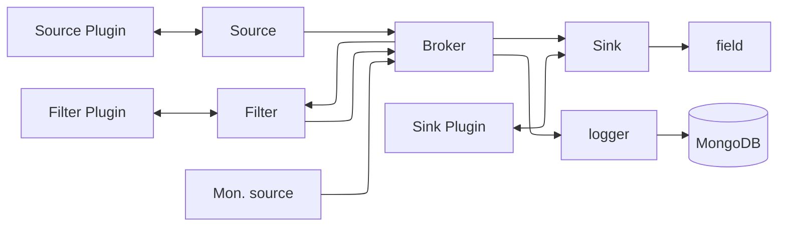

# MADS

Multi-Agent Distributed System for monitoring and control of industrial processes

**NOTE**: for Windows users, please see the [Windows support](#windows-support) section below.

## Architecture

The architecture is based on a distributed network of processes, called **agents**, connected via ZeroMQ protocol as publishers-subscribers, using a central **broker** for network discovery and settings sharing.

Agents can be implemented as **monolithic processes**, i.e. a single executable that performs a specific task, or as **plugins**, i.e. shared libraries that can be loaded at runtime by a general purpose executable.

**Plugins** can be of three different types:

* **Sources**: they grab data from the field and publish them to the broker
* **Filters**: they receive data from other sources or filters, process them, and publish the results to the broker
* **Sinks**: they receive data from the broker and process them locally (visualizing, logging, bridging to other networks, etc.)

There are three corresponding general purpose, plugin-based agents, named `source`, `filter`, and `sink`.

Some specific monolithic agents are also available for common tasks, such as `logger`, which saves incoming data to a MongoDB database.




## Settings

The settings are stored in an INI file according to the [TOML format](https://toml.io). By defaut, the setting file is read by the broker (which must be the first process to start), and then passed to the other processes via a ZeroMQ REQ/REP socket. This way, all agents share the same settings even if they run on different filesystems.

The settings file is divided into sections, one for each agent. The section name is the name of the executable file, without the path and the extension. For example, the settings for the `logger` agent are stored in a section named `[logger]`.

An `[agents]` section is also present, which contains the settings that are meant to be shared among all agents.

## Database

The logger agent can log all the messages to a plain file or to a MongoDB database (or both). MongoDB is the preferred route: file output is just for debugging purposes.

The suggested way to install MongoDB is via Docker. The following command will install the latest version of MongoDB in a Docker container, and will expose the default port (27017) to the host machine.

```bash
docker run --name mads-mongo --restart unless-stopped -v ${PWD}/db:/data/db -p27017:27017 -d mongo
```

The `Logger` agent connects to a MongoDB instance. The URI of the database (possibly on a different machine) is specified in the `mads.ini` file, as well as the name of the database to be used.

For each and every message received by the `logger` agent, it saves a new document on a table named as the topic of the message. The document contains the following fields:

* `_id`: a unique identifier for the document, automatically generated by MongoDB
* `timestamp`: the timestamp of the message
* `message`: the message itself, as a JSON object
* `error`: error message when the JSON is not valid


## Development

The code is supposed to be compiled and run on Windows, Linux or MacOS, and shall be portable to x86 or ARM architecture.

Project configuration is performed via cmake and compilation preferably via clang, although gcc should work as well.

Third party libraries are preferably built locally (within the `external` dir), to make the code more robust and self-contained, avoiding possible issues deriving from libraries version mismatch. When possible, third party libraries are **statically compiled** and linked.

Currently, the following libraries are available:

* zmq (ZeroMQ)
* zmqpp (C++ wrapper for ZeroMQ)
* snappy (fast compression library)
* mongocxx (MongoDB C++ driver)

Also, the following header-only libraries are available:

* [cxxopts](https://github.com/jarro2783/cxxopts) (command line options parser)
* [toml](https://github.com/marzer/tomlplusplus) (TOML/INI configuration file parser)
* [nlohmann/json](https://github.com/nlohmann/json) (JSON parser/emitter)


### Compilation

[](https://asciinema.org/a/N5sDE7O5TDfx4rQIj6t3rt3pN)

It is supposed to be compiled **out of source**, i.e. from a separate directory, to avoid polluting the source tree with build artifacts.

```bash
cmake -Bbuild -DCMAKE_BUILD_TYPE=Release
cmake --build build -j8
cmake --install build
```

In the configuration step (`cmake -Bbuild ...`) some of the targets can be explicitly disabled, so that if they are known not to compile on the current platform, they will not be built. For example, to disable the `logger` target, run:

```bash
cmake -Bbuild -DCMAKE_BUILD_TYPE=Release -DMADS_ENABLE_LOGGER=OFF
```

To see the complete list of optional targets, run CMake in interactive mode (notice the **double leading** 'c'!):

```bash
ccmake -Bbuild
```

`ccmake` can be installed via `apt install cmake-curses-gui` on Debian/Ubuntu. As an alternative, you can use the graphical `cmake-gui` tool. You can also list the available options with `cmake -Bbuild -LH | grep MIROSCIC`.

**NOTE**: cmake checks-compiles external libraries, which may take some time in the making. Once the external libraries are compiled, you can disable this ckeck with the cmake option `-DMADS_SKIP_EXTERNALS=ON`. Likewise, header-only libraries are grabbed via CMake `FetchContent` module, which may take some time. You can disable this check with the cmake option `-DFETCHCONTENT_FULLY_DISCONNECTED=ON`.

### Coding style

* We use **C++17 standard**.
* Classes and namespaces shall be named in `CamelCase`, variables and functions in `snake_case`, member variables shall have a leading underscore.
* Globals are discouraged, but if used, they shall be named in `__snake_case__` (two leading and trailing underscore).
* Preprocessor macros shall be named in `SNAKE_CASE`.
* Header files shall have `.hpp` extension, source files `.cpp` extension.
* All classes and library files shall go in `src` dir. These are compiled as a single static library, to be included from executables
* All source files with `main()` function shall go in `src/main` dir.
* `clang-format` shall be used to enforce a common coding style using LLVM style.


### How to implement an agent

To implement a **monolithic agent** two files have to be created:

* `src/new_agent.hpp`. This is a class that inherits from `Mads::Agent` and should:
  * override the method `Mads::Agent::load_settings()`, which has to load the customized settings from the INI file
  * implement custom methods for its specific funxtionality
* `src/main/new_agent.cpp`: this is the executable code.

The base `Agent` class provides all the low level functionality to exchange information with the other agent via broker.

In the main function for the new agent, the steps to follow are:

1. Instantiate the new agent: `auto agent = MyNewAgent(argv[0], "settings.ini")`. This way, the agent reads the settings in the ini file from the section named after the last element in `argv[0]`, i.e. the executable file name
2. If the agent is a source, call `agent.connect_sub()`, which sets up the connection to the broker `XSUB` port
3. If the agent is a filter or a sink, also call `agent.connect_pub()`, which sets up the connection to the broker `XPUB` port
4. Optionally, print configuration input with `agent.info()`
5. Within the main loop, you typically have to:
   1. If the agent is a source, read data from the field and pack them as JSON using `nlohmann::json`
   2. If the agent is filter or sink, read incoming topics with `agent.receive()`. This receives inbound messages and stores them in a status hash (one key per topic), retrivable with `agent.status()`. The very last message is available as a tuple `topic,content` from `agent.last_message()`. Messages are encoded as JSON, so decoding is needed with `nlohmann::json` class
   3. Operate on inbound or field data to build the new outbound payload
   4. Publish the new payload with `agent.publish()`. It will use the topic specified in the settings file.
6. That's it. 

In order to keep the code more readable and organized, the algorithms implemented in step 5.3 are preferably implemented in the class `MyNewAgent`, rather than in the main function or in the executable file.

For **plugin agents**, see the [dedicated section below](#plugins).

### Windows support

Most of the targets are also supported on Windows. These are tested for building with **Visual Studio 2022**. Previous releases of Visual Studio may work, but are not tested.

On Windows, you have to compile **and install** with `cmake --build build --config Release -t install`, so that the commands and any possible DLL needed by them will be installed in `products/bin` and can be run directly from there, for example as `.\products\bin\broker.exe`. 

Note that the DLLs are only installed in `products/bin`, so if you try to run the executables from the build directory (e.g. `build/Release/force_platform`), the progarams will not found the DLLs and crash on launch. On Windows 11 **the crash is silent**, on previous versions you will get a message box with the error.

Also look at the [Development](#development) section for details about DLLs.


### Git management

Developers are supposed to work on **forked repositories** and submit pull requests to the main repository. The main repository is supposed to be read-only for all developers, and only project managers can merge pull requests.

To keep the forked repository in sync with the main repository, the following steps can be followed:

1. add the main repository as a remote: `git remote add upstream https://github.com/pbosetti/mads.git`
2. fetch new changes from the main repository: `git fetch upstream`
3. merge the new changes into the local `master` branch: `git merge upstream/master master`

Once you have made your changes to the local repository, you can push them to your forked repository, and then submit a pull request to the main repository via the GitHub web interface or by using the CLI `gh` tool.

# Plugins

## Rationale

The project is designed to be extensible via plugins. A plugin is a shared library that can be loaded at runtime by the main executable, and that can be used to extend its functionality.

The plugin system is based on the `dlopen` and `dlsym` functions, which are available on Unix systems. On Windows, the equivalent functions are `LoadLibrary` and `GetProcAddress`.

The plugin system is based on the C++ [pugg library](https://github.com/pbosetti/pugg), which simplifies and abstracts the loading and unloading of plugins.

The advantages of the pluging systems are:

* each plugin can be developed in separate repos and compiled separately from the main executables, reducing the number of dependencies of this repository
* the main executables can be compiled without the plugins, and the plugins can be added later, without recompiling the main executables
* in the future, it would be possible to have the broker distribute the plugins to the agents, so that the agents can load the plugins at runtime together with the settings file
* Respect to have completely separate projects and repos for whole agents, the plugins are supposed to be smaller and more focused, and much easier to develop: they can act as simple blocks that takes an input in the form of a JSON object and provide a similar output. No knowledge about the Miroscic agent network is required


## How to develop a plugin

To develop a plugin follow these steps:

1. use the template repo [mads_plugin](https://github.com/pbosetti/mads_plugin). Click on the green button "Use this template" to create a new repo with the same structure
2. look at the fils within `src/plugin` dir. Duplicate one of the source or filter or sink plugins and customize it. The plugin  must have a plugin class derived from one of the base plugin classes that you find in `src`
3. customize the `CMakeLists.txt` file to compile the plugin. Add any external library needed by the plugin. If the libraries are static, you won't need to install them in the target system, but the resulting plugin file would be bigger (possibly an issue if distributing plugins via broker)
4. in developing the plugin you must also add a `main()` function, which is used to test the plugin. This function is not used in the final plugin, but it is useful to test the plugin in isolation
5. once the plugin is ready, compile it and copy it on the target system where the Miroscic agent is supposed to run
6. the Mads agent is `source`, `filter`, or `sink`: it takes the name of the plugin as a key for loading the proper settings section and as a publishing topic. Settings are passed to the plugin as a JSON object on loading, the name of the section being the name of the plugin file (no extension).