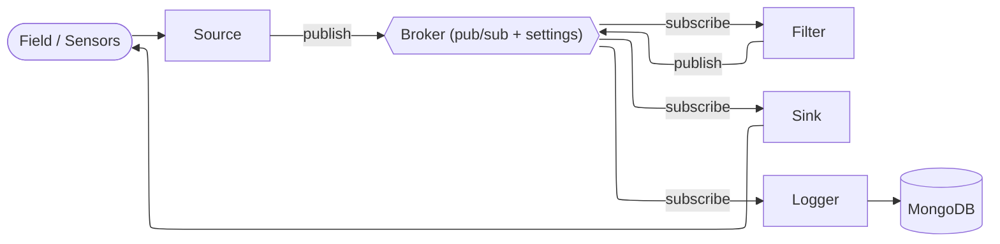
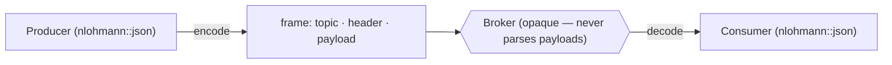
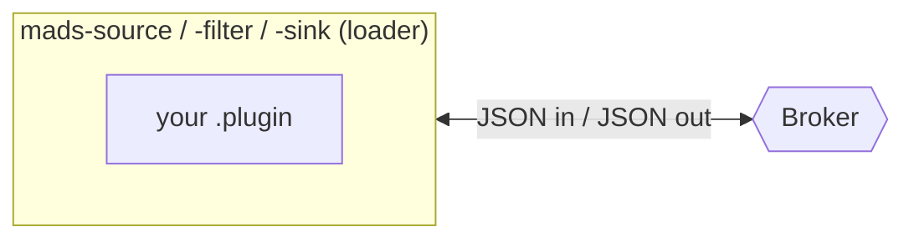

<div align="center">

# MADS

### Multi-Agent Distributed System

**A lightweight framework for real‑time robotics or monitoring and control of industrial processes — built from small, composable agents that talk over a ZeroMQ message bus.**

[Documentation](https://mads-net.github.io) · [Compiling](COMPILE.md) · [Changelog](CHANGES.md) · [License](#license)

  [](https://codecov.io/gh/pbosetti/MADS) [](http://www.apache.org/licenses/LICENSE-2.0)

</div>

---

## What is MADS?

MADS lets you build a data pipeline out of **independent processes** — *agents* — that you can start, stop, move between machines, and rewire without touching each other. Each agent does one job (read a sensor, transform a stream, log to a database, drive an actuator) and exchanges **JSON messages** over a publish/subscribe bus. A central **broker** handles discovery and hands every agent the same configuration, so the whole fleet stays consistent even when it spans several computers.

You extend MADS the way that fits you:

- 🧩 **Drop‑in plugins** — write a tiny `.plugin` that turns one JSON object into another; the runtime handles all the networking.
- 🛠️ **Native C++ agents** — subclass `Mads::Agent` and let `AgentApp` take care of CLI parsing, settings, startup and shutdown.
- 🐍 **Python** — drive an agent end‑to‑end from a script via the ctypes wrapper.

> 📖 Full guides, tutorials and API docs live at **<https://mads-net.github.io>**.

### Why you might like it

- **Composable** — pipelines are wired in a config file, not in code.
- **Distributed by default** — agents find the broker automatically; settings are served centrally.
- **Polyglot & portable** — C++ core, C ABI, Python wrapper; Linux, macOS and Windows.
- **Fast** — ZeroMQ transport, Snappy compression, an **opt‑in MessagePack wire format**, and a zero‑copy receive fast path.
- **Batteries included** — ready‑made agents for logging to MongoDB, bridging, feedback/inspection, and more.
- **Secure** — optional CURVE encryption and IP allow‑listing on every socket.

---

## Architecture at a glance


```mermaid
%%{init: {"flowchart": {"defaultRenderer": "elk"}} }%%
flowchart LR
    field([Field / Sensors])
    broker{{"Broker (pub/sub + settings)"}}
    src["Source"]
    flt["Filter"]
    snk["Sink"]
    log["Logger"]
    db[(MongoDB)]

    field --> src
    src -- publish --> broker
    broker -- subscribe --> flt
    flt -- publish --> broker
    broker -- subscribe --> snk
    broker -- subscribe --> log
    snk --> field
    log --> db
```

- **Source** — produces data and publishes it.
- **Filter** — subscribes, transforms, republishes.
- **Sink** — subscribes and consumes locally (UI, logging, bridging, actuation…).
- **Broker** — a payload‑agnostic ZeroMQ `XSUB`/`XPUB` proxy that also serves settings over a `REQ`/`REP` socket and advertises itself for auto‑discovery.

Agents come in two flavours: **monolithic** executables (one purpose‑built binary) and **plugin‑based** ones (a generic loader — `mads‑source`, `mads‑filter`, `mads‑sink` — that loads a `.plugin` at runtime).

---

## Quick start

```bash
# Build & install (see COMPILE.md for prerequisites)
cmake -Bbuild -DCMAKE_BUILD_TYPE=Release -GNinja
cmake --build build -j6
cmake --install build
```

Run your first pipeline — a data source feeding a live console sink:

```bash
mads broker &           # 1. start the hub (always first)
mads feedback &         # 2. a sink that pretty-prints every message
mads perf_assess -l 64 -p 500   # 3. a source emitting a 64-byte payload every 500 ms
```

You’ll see `feedback` print each message the source publishes. Swap step 3 for your own source, add filters in between, point `logger` at MongoDB — all by editing `mads.ini`, not the binaries.

> `mads <name>` is a convenience launcher for the `mads-<name>` executables. `mads -p` prints the install prefix; `mads plugin` scaffolds a new plugin project.

---

## Talking to the bus: the message & wire format

Every message is a pair `[topic, payload]`. Your code always works with a **`nlohmann::json` object** (or a Python `dict`); MADS handles the bytes on the wire.


```mermaid
flowchart LR
    p["Producer (nlohmann::json)"] -->|encode| h["frame: topic · header · payload"]
    h --> b{{"Broker (opaque — never parses payloads)"}}
    b -->|decode| c["Consumer (nlohmann::json)"]
```

Because the broker never looks inside payloads, the wire format can evolve with **zero broker changes**.

### JSON by default, MessagePack when you want it

| | Default | Opt‑in |
|---|---|---|
| **Encoding** | JSON (human‑readable, universal) | **MessagePack** (compact binary) |
| **Compression** | `auto` (Snappy above 256 B) | `snappy` (always) · `none` |
| **Framing** | legacy 2/3‑part frame | self‑describing header `{format, compression, schema_version}` |

Switch formats per agent or fleet‑wide in `mads.ini` — no recompilation:

```toml
[agents]            # fleet-wide default
wire_format = "msgpack"   # "json" (default) | "msgpack"
compression = "auto"      # "auto" (default) | "snappy" | "none"

[my_fast_source]    # …or override per agent
wire_format = "msgpack"
compression = "none"      # already compact; skip Snappy on a LAN
```

It’s also reachable from C (`agent_set_wire_format`) and Python (`set_wire_format`). Mixed fleets interoperate: every up‑to‑date receiver transparently decodes both formats thanks to the self‑describing header.

### How it performs

The right choice depends on your payload and your consumer. From the bundled benchmarks (Apple M‑series, release build):

- **Encoding is much cheaper in MessagePack** — JSON has to scan and escape every byte; MessagePack bulk‑copies. For a 16 KB payload, encoding is ~**30× faster**.
- **Wire size** shrinks for numeric/structured data; for already‑compressible text the gap narrows once Snappy kicks in.
- **Receiving** is fastest when your consumer wants the *object*: the agent keeps the decoded message and hands it over without re‑serializing.

To make that last point real, consumers can pull the parsed object directly with **`last_json()`** instead of re‑parsing text. On a MessagePack stream this **more than doubled** sink throughput:

| Payload | `last_message()` + parse | `last_json()` (fast path) | Speed‑up |
|--------:|-------------------------:|--------------------------:|:--------:|
| 1 KB    | 45,400 msg/s | **92,700 msg/s** | **2.0×** |
| 16 KB   | 5,200 msg/s | **14,300 msg/s** | **2.8×** |

<details>
<summary><b>Rule of thumb & methodology</b></summary>

- **Use JSON** for control/observability topics, debugging, and interop with external tools — it’s readable on the wire.
- **Use MessagePack** for high‑rate or numeric/array‑heavy telemetry, especially when the consumer processes the object (filters, sinks) rather than re‑printing it as text. Pair it with `compression = "none"` on fast local links.
- A sink that *re‑stringifies* every message (e.g. printing it) is text‑bound and won’t benefit from MessagePack — and the framework still gives it correct JSON either way.

Benchmarks use the bundled `perf_assess` source and `feedback`/compute sinks through a real broker. Numbers are indicative, not guarantees — measure with *your* payload. The transport (Snappy + ZeroMQ + network) usually dominates the codec.
</details>

---

## Record & replay

`mads-record` and `mads-play` capture live traffic to a bag file and play it back later — for regression tests, offline analysis, or reproducing a bug without the original hardware.

```sh
mads-record -o session.bag          # subscribes per sub_topic, writes a bag file
mads-play -i session.bag            # republishes it, byte-for-byte
mads bag info -f session.bag        # O(1) summary: record count, time span, CRC/index status
mads bag export -f session.bag --format jsonl > session.jsonl
```

A bag file is a small, bespoke binary format (`src/bag.hpp`) — not MCAP — that stores each message's exact multi-part wire frame (topic + parts), so **JSON and binary blobs both round-trip byte-identical**, with no re-parsing or re-copying on the way through. This is powered by two new, purely additive `Agent` methods, `receive_raw_message()`/`publish_raw_message()`, that expose the raw frame without any JSON (de)serialization. A trailing index gives `mads bag info` O(1) access; if the recording process is killed before that index is written, the reader falls back to a linear scan that recovers every complete record and reports the file as truncated instead of failing.

`mads-play` supports `--topics 'sensors/#'` (the same MQTT-style filter `sub_topic` uses), `--rate 2.0` to pace replay relative to the recorded gaps between messages, and `--restamp` to refresh timestamps on replay. See [share/man/mads-record.md](share/man/mads-record.md), [share/man/mads-play.md](share/man/mads-play.md), and [share/man/mads-bag.md](share/man/mads-bag.md).

---

## Extending MADS

### 1) Plugins — the fast path

A plugin is a small shared library that transforms JSON. It knows nothing about ZeroMQ, the broker, or settings plumbing — the loader injects all of that. Three kinds map to the three agent roles:


```mermaid
flowchart LR
    subgraph L["mads-source / -filter / -sink (loader)"]
      direction TB
      plug["your .plugin"]
    end
    broker{{Broker}}
    L <-->|JSON in / JSON out| broker
```

| Plugin kind | You implement | Loaded by |
|---|---|---|
| **Source** | `get_output(json &out)` | `mads-source` |
| **Filter** | `load_data(json in)` + `process(json &out)` | `mads-filter` |
| **Sink** | `load_data(json in)` | `mads-sink` |

```bash
mads plugin my_filter --type filter   # scaffold a C++ plugin project
# edit src/my_filter.cpp, then:
cmake -Bbuild -GNinja && cmake --build build
mads filter my_filter.plugin          # run it
```

Plugins are developed and versioned in their own repos, compiled independently, and selected (with their settings section) by file name — or by `-n <name>` to run the same plugin in several roles with different configs.

#### Rust plugins

The same three plugin kinds are also supported in **Rust** — no C++ toolchain needed. The `--rust` flag scaffolds a Cargo project instead; a dedicated set of loaders (`mads-rsource`, `mads-rfilter`, `mads-rsink`) handle the runtime side via a stable C ABI.

```bash
mads plugin my_filter --type filter --rust   # scaffold a Rust plugin project
# implement the FilterPlugin trait in src/lib.rs, then:
cargo build --release
mads-rfilter target/release/libmy_filter.so  # run it
```

See **[rust/README.md](rust/README.md)** for the full guide: trait reference, return codes, output types, loader options, and packaging.

### 2) Native agents with `AgentApp`

For full control, subclass `Mads::Agent` and wrap it with `AgentApp` ([`src/agent_app.hpp`](src/agent_app.hpp)), which folds away the repetitive CLI/startup boilerplate (option parsing, settings, identity, queue sizing, events, remote control, graceful restart):

```cpp
#include "agent_app.hpp"
using namespace Mads;

int main(int argc, char *argv[]) {
  AgentApp agent{argv[0], SETTINGS_URI};
  agent.add_common_options();
  auto parsed = agent.parse_options(argc, argv);
  if (int rc = AgentApp::handle_standard_exit_options<AgentApp>(
          parsed, agent.raw_options(), argv); rc >= 0)
    return rc;

  agent.init(parsed);
  agent.enable_events();
  agent.connect();
  agent.info();

  agent.loop([&]() -> std::chrono::milliseconds {
    if (agent.receive() == message_type::json) {
      auto [topic, msg] = agent.last_json();   // parsed object, zero re-parse
      // …process msg, then…
      agent.publish({{"result", 42}});
    }
    return 0ms;
  });

  agent.disconnect();
  agent.restart_if_requested(argv);
}
```

Existing subclasses (`Bridge`, `Dealer`, `Worker`, `Logger`, …) can be wrapped without modification via `AgentAppFor<T>`.

### 3) Python

Drive an agent from Python through the ctypes wrapper (installed at `<prefix>/python/mads_agent.py`):

```python
from mads_agent import Agent, WireFormat, MessageType

agent = Agent("my_agent", "tcp://localhost:9092")  # settings URI = broker
agent.init()
agent.set_wire_format(WireFormat.MSGPACK)          # optional
agent.connect()

agent.publish({"temperature": 21.7, "unit": "C"})

if agent.receive() == MessageType.JSON:
    topic, message = agent.last_message()
    print(topic, message)
```

Point it at a specific library with the `MADS_LIB_PATH` environment variable, or let it resolve via `mads -p`.

---

## Configuration

Settings live in a single **TOML** file (`mads.ini`). The **broker reads it first** and serves it to every agent over the settings socket, so a distributed fleet shares one source of truth.

- One `[section]` per agent, named after the executable (`mads-logger` → `[logger]`) or the plugin file (`clock.plugin` → `[clock]`, or `[custom]` with `-n custom`).
- A shared `[agents]` section holds fleet‑wide defaults (endpoints, timecode FPS, wire format…).
- Common keys: `pub_topic` (string), `sub_topic` (array; `[""]` = subscribe to all), `queue_size`, `time_step`.

```toml
[agents]
frontend_address = "tcp://localhost:9090"
backend_address  = "tcp://localhost:9091"

[logger]
mongo_uri = "mongodb://localhost:27017"
mongo_db  = "mads"
sub_topic = [""]          # log everything
```

---

## Logging to MongoDB

The `logger` agent persists every message to MongoDB (and/or a plain JSON file for debugging). Each message becomes a document in a collection named after its topic:

| field | meaning |
|---|---|
| `_id` | document id (MongoDB) |
| `timestamp` | BSON date when logged |
| `message` | the payload, as a BSON document (extended‑JSON `$date` fields become real BSON dates) |
| `error` | set instead of `message` if the payload was unparsable |

Spin up MongoDB quickly with Docker:

```bash
docker run --name mads-mongo --restart unless-stopped \
  -v ${PWD}/db:/data/db -p 27017:27017 -d mongo
```

---

## Building

See **[COMPILE.md](COMPILE.md)** for prerequisites and platform notes. In short: CMake (out‑of‑source), C++20, Ninja recommended.

```bash
cmake -Bbuild -DCMAKE_BUILD_TYPE=Release -GNinja
cmake --build build -j6
cmake --install build
```

Key dependencies: ZeroMQ (`libzmq` + `zmqpp`), `nlohmann/json`, `toml++`, Snappy, `pugg` (plugins), and the MongoDB C++ driver (optional, for the logger).

> All these dependencies are bundled and built from source via CMake FetchContent, so no external library installation is needed.

---

## Coding style

- **C++20**; LLVM style enforced with `clang-format`.
- Classes & namespaces `CamelCase`; functions & variables `snake_case`; member fields `_leading_underscore`.
- Headers `.hpp`, sources `.cpp`. Library code in `src/`; executables (with `main()`) in `src/main/`.
- Prefer extending existing abstractions (`Mads::Agent`, `AgentApp`, plugin drivers) over re‑implementing transport/config plumbing.

---

## License

Distributed under the [Apache 2.0 license](http://www.apache.org/licenses/LICENSE-2.0) license.

## Authors

**Paolo Bosetti** (University of Trento) — main author.
Contributors: **Anna‑Carla Araújo** (INSA Toulouse), **Guillaume Cohen** (INSA Toulouse).
